  

  

 

## ▸ what i do

<table>
  <tr>
    <td width="33%" valign="top">
      <b>📊 data scientist</b>  
      Credit risk modeling 
      Customer segmentation 
      A/B testing + experiment design 
      Statistical hypothesis testing
    </td>
    <td width="33%" valign="top">
      <b>🛠️ data engineer</b>  
      SQL window function feature pipelines 
      ETL pipelines in Python + SQL 
      dbt + Spark on Databricks 
      Airflow orchestration
    </td>
    <td width="33%" valign="top">
      <b>🤖 ai/ml engineer</b>  
      Gradient boosting (LightGBM, XGBoost) 
      Model evaluation + validation 
      LLM API integration
    </td>
  </tr>
</table>

 

## ▸ featured work -

<table>
  <tr>
    <td width="50%" valign="top">
      <h3>Loan Default Risk Prediction</h3>
      
      
      
      
<i>scoring credit risk from payment behavior, not just credit score</i>

      <ul>
        <li>25K+ loans across 4 relational tables</li>
        <li>28 features engineered using SQL window functions</li>
        <li>LightGBM with 5% lift over a logistic regression baseline</li>
      </ul>
      <a href="https://github.com/priyavijay1214/Loan-Default-Risk-Prediction"><b>→ view repo</b></a>
    </td>
    <td width="50%" valign="top">
      <h3>Customer Segmentation</h3>
      
      
      
      
<i>turning 30K transactions into segments a marketing team can act on</i>

      <ul>
        <li>RFM features computed entirely in SQL</li>
        <li>K-Means clustering with elbow and silhouette evaluation</li>
        <li>6 actionable customer segments identified</li>
      </ul>
      <a href="https://github.com/priyavijay1214/project"><b>→ view repo</b></a>
    </td>
  </tr>
</table>

 

## ▸ toolkit

  

  
  
  
  
  
  
  

  

